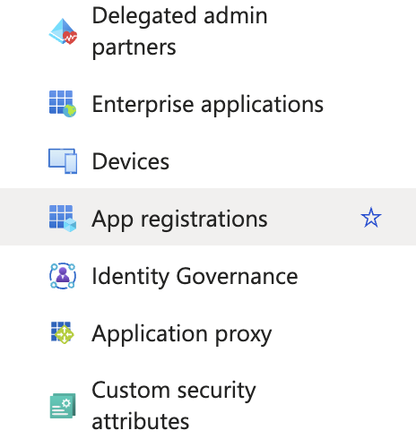
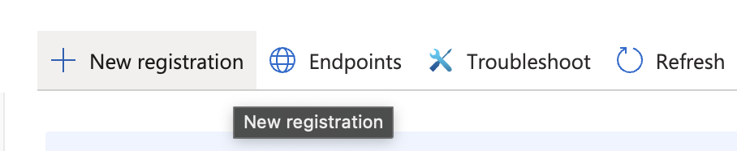
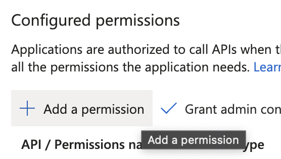
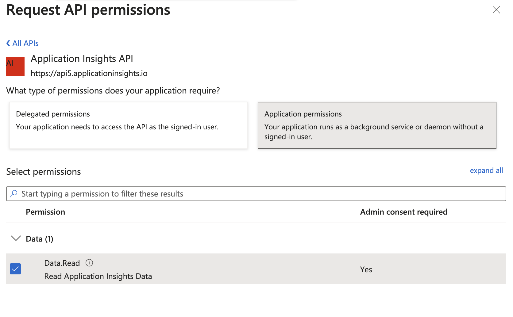
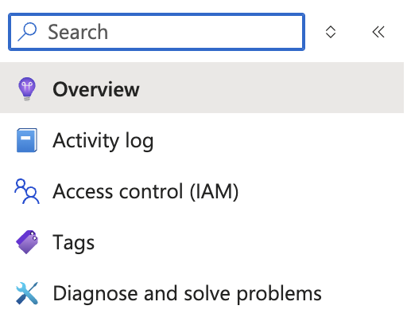
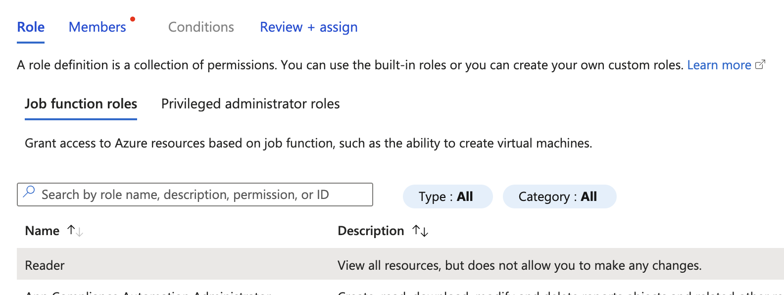
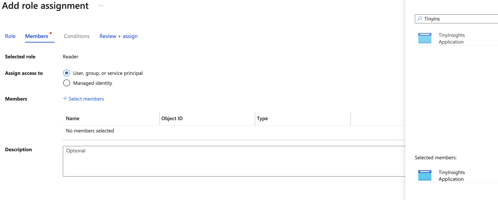

# How to set up and configure the web site
From March 2025, API Key will not longer be an option for authenticate against the Azure Application Insights API.

That means that the users need to be authenticated with Entra ID.  TinyInsights has a Blazor server application that can be deployed to your environment so you can continue to use it to visualize the data you have logged to Application Insights. The reason a server solution is used, is that is will be more secured to store the Entra settings on a server.


## Configure Azure and Entra
1. Sign in to the **Azure Portal**.
2. Navigate to **Microsoft Entra ID**.
3. In the left menu, expand **Manage** and go to **App registrations**.

4. Click **New registration** at the top menu bar.

5. Give the application a name, TinyInsights for example. Add a redirect url with web as the platform. The uri should be the uri to your site, edning with **/signin-oidc**.

6. Save

7. Go to **Api Permissions** 


8. Click **Add a permission** 

9. Select the tab **APIs my organization uses** and search for **Application Insights API** and select it.

10. Select **Application permissions** and Save.

11. Click **Grant admin consent for...** 
12. Navigate to your Application Insights instance.
13. Click **Access control(IAM)** in the menu.

14. Click **Add**  and then **Add role assignment**

15. Select the reader role.

16. Then add the app as a member of that role.

17. Save


## Settings

This has to be added to appsettings.json:

```json
 "AzureAd": {
    "Instance": "https://login.microsoftonline.com/",
    "Domain": "{YOUR-DOMAIN}",
    "TenantId": "{YOUR-TENANT-ID}",
    "ClientId": "{YOUR-APP-CLIENT-ID}",
    "CallbackPath": "/signin-oidc",
    "ClientCredentials": [
      {
        "SourceType": "ClientSecret",
        "ClientSecret": "{YOUR-APP-CLIENT-SECRET}"
      }
    ]
  },
  "ApplicationInsightsAppId": "{YOUR-APPLICATION-INSIGHT-APP-ID}"
  ```

**A client secret can be created under **Certificates & Secrets** for your Entra ID application. And you will also find the rest of the info on the overview page for the application.

**Application id will be found under **API Access** menu for your applicationinsights instance.

